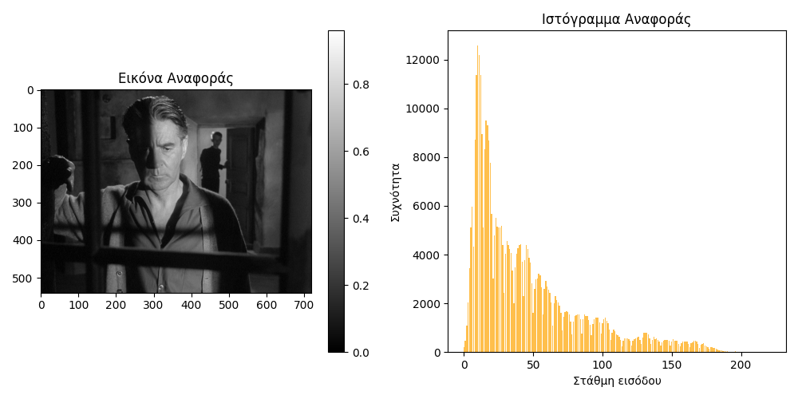
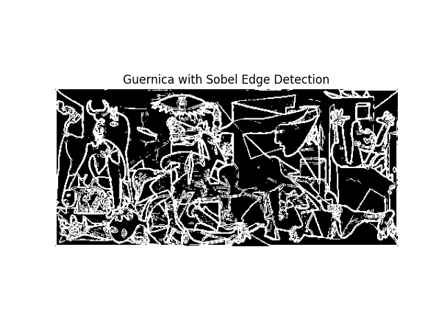

Digital Image Processing Project:
- First Assignment: Variations of Histogram Equalization and Histogram Matching Algorithms

  

- Second Assignment: Edge and circle detection

  

- Third Assignment: Image Segmentation

  
